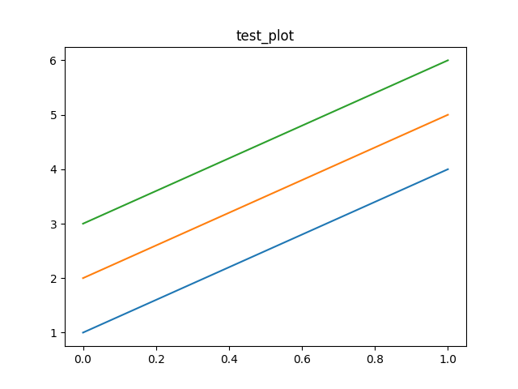
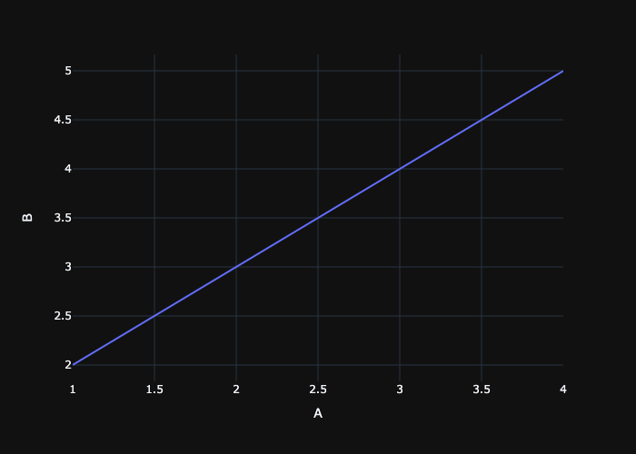

## Disclaimer
This is the result of the output for the provided notebook, however the relative links have been manually modified
to be able to showcase it anywhere, so that the assets can be accessed. Also the table embedding is not supported by default in markdown, but is handled
well in Obsidian. The images are displayed as expected.


```run-python
import matplotlib.pyplot as plt
import pandas as pd
import plotly.express as px
from obsidianize import obsidian_pandas, obsidian_plotly, obsidian_pyplot
```

```run-python
dummy_data = [[1, 2, 3], [4, 5, 6]]
df = pd.DataFrame(dummy_data, columns=['A', 'B', 'C'])
```

```run-python
obsidian_pandas(df, 'test_table')
```

#### Results


```run-python
fig = plt.figure()
plt.plot(dummy_data)
obsidian_pyplot(fig, 'test_plot')
```

#### Results


```run-python
figure = px.line(df, x='A', y='B')
obsidian_plotly(figure, 'test_plotly')
```

#### Results

